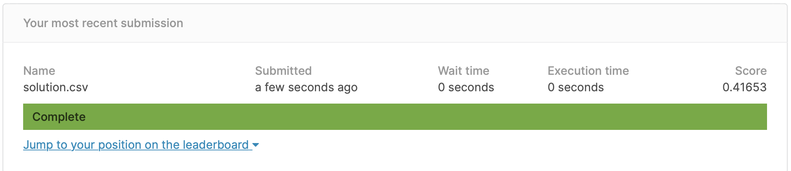

```{r setup, include=FALSE}
knitr::opts_chunk$set(echo = TRUE, message=FALSE,  warning=FALSE,fig.width=10, fig.height = 8)
```

<p align="center">
  <br>
    <b>Bike Sharing Demand 링크: [Bike Sharing Demand](https://www.kaggle.com/c/bike-sharing-demand)</b><br>
  <b>Github Code: [Unifinished God/Kaggle](https://github.com/Unfinishedgod/Kaggle/blob/master/Bike_Sharing_Demand/Bike_Sharing_Demand.Rmd)</b><br>
</p>


## 데이터 형식 
- datetime: 년-월-일 시간 데이터
- season:  1 = 봄, 2 = 여름, 3 = 가을, 4 = 겨울 
- holiday: 공휴일 또는 주말
- workingday: 공휴일, 주말을 제외한 평일
- weather 
  - 1: 매우 맑음(Clear, Few clouds, Partly cloudy, Partly cloudy)
  - 2: 맑음(Mist + Cloudy, Mist + Broken clouds, Mist + Few clouds, Mist)
  - 3: 나쁨(Light Snow, Light Rain + Thunderstorm + Scattered clouds, Light Rain + Scattered clouds)
  - 4: 매우 나쁨(Heavy Rain + Ice Pallets + Thunderstorm + Mist, Snow + Fog)
- temp: 기온
- atemp: 체감온도 정도로 보자
- humidity: 상대 습도
- windspeed: 바람의 세기
- casual: 미등록 사용자 렌탈 수 
- registered: 등록된 사용자 렌탈수 
- count: 렌탈한 총 합

```{r}
library(tidyverse)
library(lubridate)
library(stringr)
library(caret)
library(readr)
library(gridExtra)
library(xgboost)
library(Metrics)
library(ggplot2)
library(patchwork)

train_set <- read_csv("train.csv")
test_set <- read_csv("test.csv")
submission <- read_csv("sampleSubmission.csv")

# remove casual registered
train_set <- train_set %>% 
  select(-casual, -registered) %>%  
  mutate(
    year = year(datetime),
    month = month(datetime),
    hour = hour(datetime),
    wday = wday(datetime))


test_set <- test_set %>% 
  mutate(
    year = year(datetime),
    month = month(datetime),
    hour = hour(datetime),
    wday = wday(datetime))


str(train_set)
summary(train_set)
```


# 데이터 시각화

## 각 변수별 Count와의 관계

각각의 변수는 Count와 어떤 관계를 보이는가?

```{r fig.height = 10}
train_set_vis <- train_set

train_set_vis$season  <- factor(train_set_vis$season, labels = c("Spring", "Summer", "Fall", "Winter"))
train_set_vis$weather <- factor(train_set_vis$weather, labels = c("Good", "Normal", "Bad", "Very Bad"))
train_set_vis$holiday <- factor(train_set_vis$holiday)
train_set_vis$workingday <- factor(train_set_vis$workingday)
train_set_vis$year <- factor(train_set_vis$year)
train_set_vis$month <- factor(train_set_vis$month)
# train_set_vis$hour <- factor(train_set_vis$hour)
train_set_vis$wday <- factor(train_set_vis$wday, labels = c("Sun","Mon", "Tue","Wed","Thu","Fir","Sat"))


non_hour_list <- (colnames(train_set_vis) != "count")%>% 
  which()

lst <- map(non_hour_list, function(i) {
  df_list <- colnames(train_set_vis)[i]
  
  train_set_vis %>% 
    select(df_list, count) %>% 
    rename(aa = df_list) %>% 
    ggplot(aes(aa,count)) +
    geom_point(alpha=.2,color = "#008ABC") +
    labs(title = paste0(df_list," vs count"), x = df_list, y = "",color=df_list) +
    theme_bw() +  
    theme(legend.position = "bottom")
})

grid.arrange(grobs=lst, ncol=3)
```

## Data Visualization

```{r fig.height = 10}
factor_list <- sapply(train_set_vis, is.factor) %>% 
  which()

lst <- lapply(factor_list, function(i) {
  df_list <- colnames(train_set_vis)[i]
  
  train_set_vis %>% 
    rename(aa = df_list) %>% 
    group_by(aa, hour) %>% 
    summarise(count = sum(count)) %>% 
    ggplot(aes(x = hour, y = count, group = aa, colour = aa)) +
    labs(title = paste0("Count by ",df_list), x = "Hour",  color = df_list) + 
    theme_bw() +
    geom_line()
})

grid.arrange(grobs=lst, ncol=2)
```


# Train / Test set

```{r}
train_set$count = log1p(train_set$count)

X_train <- train_set %>%
  select(-count, - datetime) %>%
  as.matrix()

y_train <- train_set$count

X_test = test_set %>% 
  select(- datetime) %>% 
  as.matrix()
```

# Grid Search / Cross Validation

```{r, results="hide"}
dtrain = xgb.DMatrix(X_train, label = y_train)

# searchGridSubCol <- expand.grid(subsample = c(0.5, 0.6),
#                                 colsample_bytree = c(0.5, 0.6),
#                                 max_depth = c(7:15),
#                                 min_child = seq(1),
#                                 eta = c(0.05,0.1,0.15)
# )
# 
# 
# ntrees <- 150
# 
# system.time(
#   rmseErrorsHyperparameters <- apply(searchGridSubCol, 1, function(parameterList){
# 
#     #Extract Parameters to test
#     currentSubsampleRate <- parameterList[["subsample"]]
#     currentColsampleRate <- parameterList[["colsample_bytree"]]
#     currentDepth <- parameterList[["max_depth"]]
#     currentEta <- parameterList[["eta"]]
#     currentMinChild <- parameterList[["min_child"]]
# 
#     xgboostModelCV <- xgb.cv(data =  dtrain, nrounds = ntrees, nfold = 5, showsd = TRUE,
#                              metrics = "rmse", verbose = TRUE, "eval_metric" = "rmse",
#                              "objective" = "reg:linear", "max.depth" = currentDepth, "eta" = currentEta,
#                              "subsample" = currentSubsampleRate, "colsample_bytree" = currentColsampleRate
#                              , print_every_n = 10, "min_child_weight" = currentMinChild, booster = "gbtree",
#                              early_stopping_rounds = 10)
# 
#     xvalidationScores <- as.data.frame(xgboostModelCV$evaluation_log)
#     rmse <- tail(xvalidationScores$test_rmse_mean, 1)
#     trmse <- tail(xvalidationScores$train_rmse_mean,1)
#     output <- return(c(rmse, trmse,currentSubsampleRate, currentColsampleRate, currentDepth, currentEta, currentMinChild))})
# )
# 
# 
# output <- as.data.frame(t(rmseErrorsHyperparameters))
# varnames <- c("TestRMSE", "TrainRMSE", "SubSampRate", "ColSampRate", "Depth", "eta", "currentMinChild")
# names(output) <- varnames
# 
# tail(output)
```

# Model  

```{r}
# tail(output)
model = xgb.train(data = dtrain, 
                  nround = 150, 
                  max_depth = 10, 
                  eta = 0.15, 
                  subsample = 0.6,
                  colsample_bytree = 0.6,
                  min_child_weight = 1)


xgb.importance(feature_names = colnames(X_train), model) %>% 
  xgb.plot.importance()


preds = predict(model, X_test)
preds = expm1(preds)

solution = data.frame(datetime = test_set$datetime, count = preds)

write.csv(solution, "solution.csv", row.names = FALSE)
```



